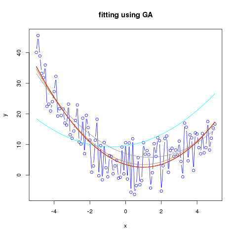

Fitting data using a GA
=======================

The sample code uses the function `f(x) = ax^2 + bx + c` (which is a verbatim text instead of a TeX equation since it seems GitHub markdown does not support math—anymore? maintenability and security concerns, as I've got it digging swiftly here and there to come up with a solution for this read-me); sample data are generated from this function and you can add random perturbation just to make the points taste more like measured data.

E.g. I have generated ten data files changing the number of iterations (generations):

```bash

for((n=100; n <= 1000; n+=100)); do
  ./gafit -perturbe 10.0 -min -5.0 -max 5.0 -iter $n -dump >ga-d$n.csv
done

```

Then I have generated a graph using R:




The R code I've used is simply:


```R

png("gafit.png")
cl <- c("cyan", "azure4", "chocolate", "chocolate3", "coral",
        "coral2", "coral4", "cyan3", "darkgoldenrod", "red")
for (n in seq(1,10)) {
    r <- read.table(paste("ga-d", as.character(n*100), ".csv", sep=""), header=T, sep=" ")
    if (n == 1) {
        plot(r$x, r$real, type="b", col="blue",
             main="fitting using GA",
             xlab="x",
             ylab="y")
        lines(r$x, r$fitted, type="l", col=cl[n])
    } else {
        lines(r$x, r$fitted, type="l", col=cl[n])
    }
}
dev.off()

```

